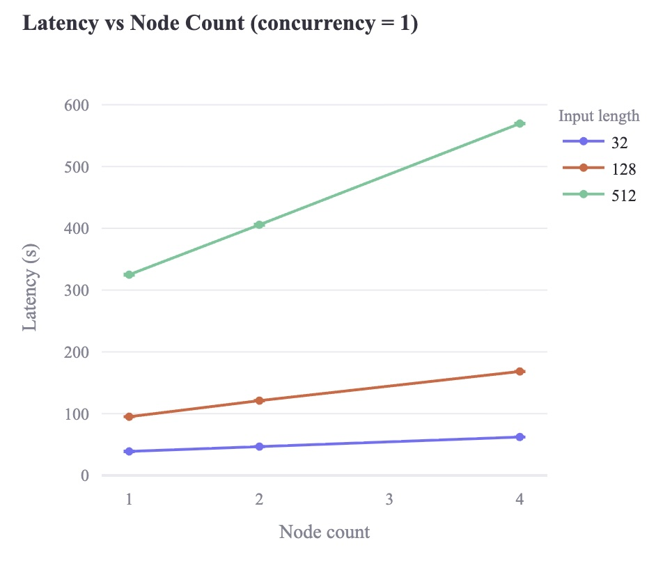
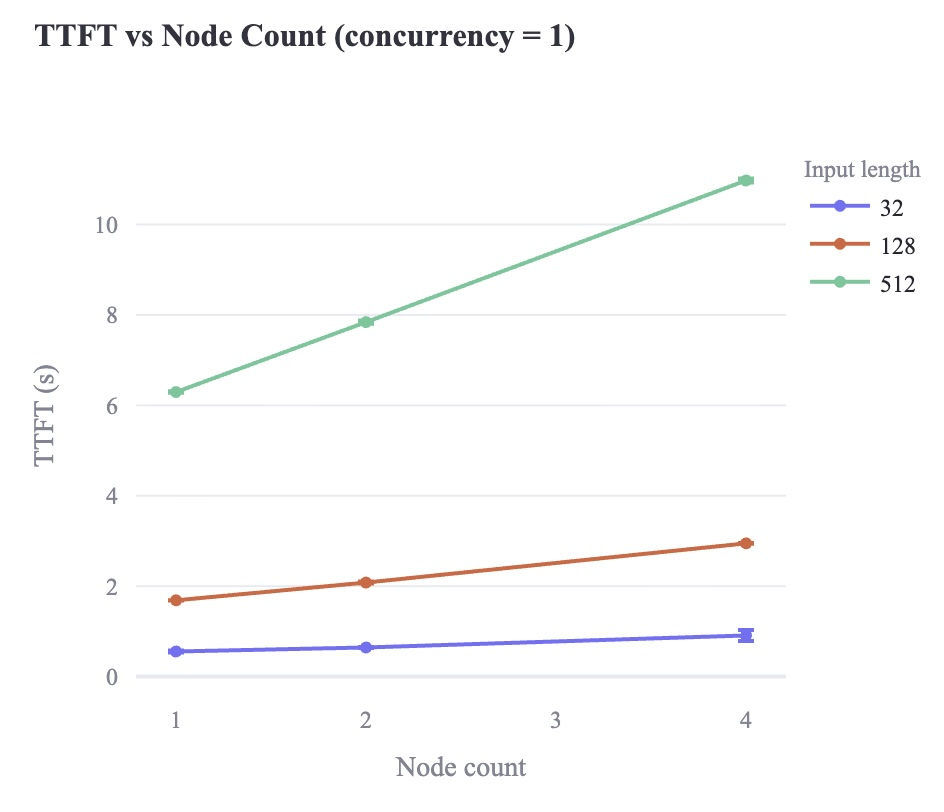
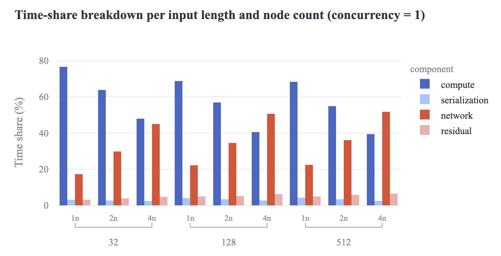
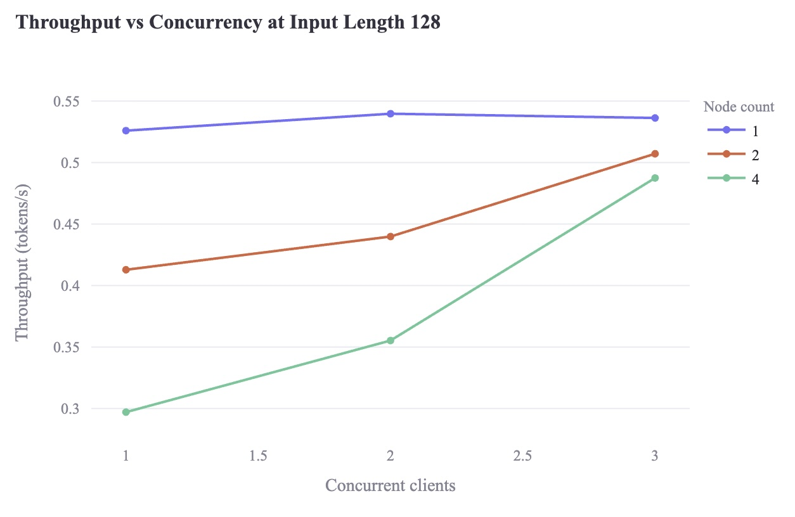
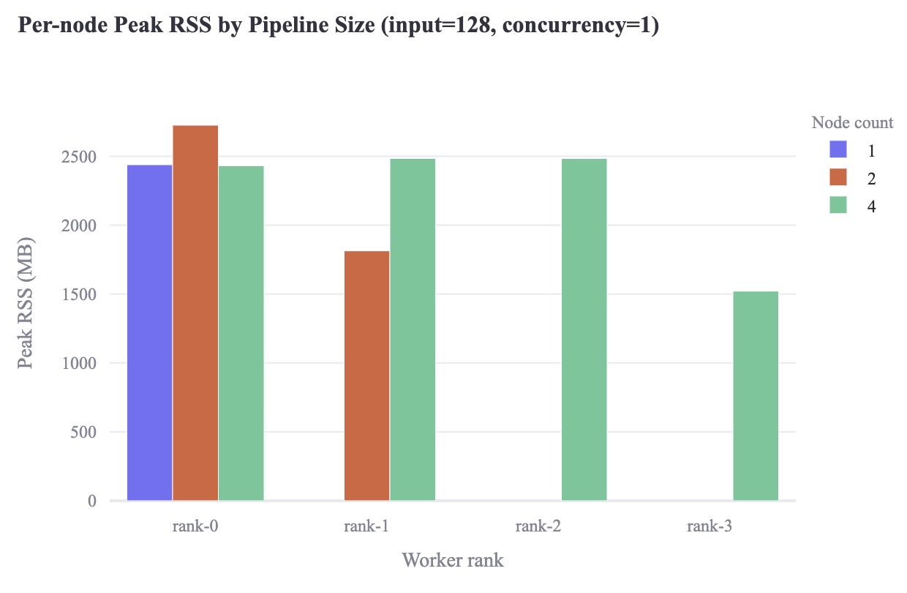

# Distributed LLM Inference Experiment

This project implements CPU-only distributed inference for GPT-2 models using pipeline model parallelism over HTTP. Read the full research paper [here](./paper/paper.pdf).

## Background

Many modern large language models (LLMs) contain billions of parameters. Due to their size, running inference on large models such as LLaMA 3.1 405B and Qwen2-72B is not feasible on a single node, necessitating sharding across multiple nodes. This project builds a distributed inference system using open-weight models by partitioning the model layers across distributed nodes. The method is layer-wise pipeline model parallelism: a transformer-based model is split across multiple machines, one contiguous shard of layers per node.

<p align="center">
  
</p>
<p align="center">
  <sub><b>Figure 1:</b> Neural network layer partitioning.</sub>
</p>

Each node runs its chunk of the model on the input activations from a microbatch and then passes the resulting activation tensor to the next node. Multiple microbatches can be processed concurrently in different pipeline stages, allowing the model to be efficiently split across smaller machines and increasing overall throughput.

<p align="center">
  
</p>
<p align="center">
  <sub><b>Figure 2:</b> Pipeline parallelism. Each microbatch is represented internally as a tensor of activations flowing between pipeline stages.</sub>
</p>

The primary goals of this study are to build such a system from scratch and benchmark its performance, scalability, and trade-offs. Due to its distributed nature, the primary penalty is latency caused by communication overhead between nodes. Additional challenges arise from scheduling complexity, fault tolerance, straggler (slow) nodes, error propagation, and debugging.

The emphasis is on the benefits and trade-offs of distributed computing in model inference; optimizing for peak performance is not a design goal. To simplify the deployment environment and save costs, the system runs on CPU only and does not utilize any GPU. By not requiring a GPU, the setup can be easily replicated on generic cloud virtual machines.

<p align="center">
  
</p>
<p align="center">
  <sub><b>Figure 3:</b> System architecture overview.</sub>
</p>

With that constraint in mind, the study uses the GPT-2 family of models. Its architecture is simple and well-understood, making every component tractable to reason about while still surfacing real distributed systems challenges. There are also practical benefits: a mature ecosystem, excellent documentation, and a permissive license (MIT).

The final benchmarks were run on GPT-2 Medium (355M parameters, 24 transformer blocks). The original plan targeted GPT-2 XL (1.5B, 48 blocks) to more strongly test the memory-pressure benefits of sharding, but high-memory-bandwidth CPU instances were not available under the project's cloud account, and large-model distributed runs hit frequent end-to-end timeouts. Scoping down to GPT-2 Medium preserved the full factor-based experiment design (node scaling, input-length scaling, concurrency scaling) within feasible runtime and budget limits.

Inter-process communication uses HTTP, as its overhead is small relative to CPU inference latency and keeps the implementation portable.

## Research Highlights

The project implements a full gateway-worker serving stack for GPT-2 Medium (355M) with contiguous layer sharding across 1, 2, and 4 nodes. Benchmarks span 15 configurations covering prompt lengths (32, 128, 512) and client concurrency (1, 2, 3) on Google Cloud `c4d-highmem-2` VMs, with per-stage compute, serialization, network hop time, memory, TTFT, and end-to-end latency instrumented at the gateway and every worker.

### Key Finding 1 — Communication overhead dominates CPU pipeline parallelism

Single-request latency grows consistently with node count across every prompt length. Relative to a single node, **4-node latency increases by 60–77%**, and TTFT follows the same trend.

<p align="center">
  
  
</p>
<p align="center">
  <sub><b>Figure 4:</b> End-to-end latency and time-to-first-token (TTFT) vs. node count.</sub>
</p>

### Key Finding 2 — Network share grows from ~17% to ~52% of wall-clock time

Decomposing wall-clock time into compute, serialization, network, and residual components reveals the regime shift: at 1 node the system is compute-bound (68–77% compute), while at 4 nodes it becomes communication-bound (45–52% network). This is a quantitative causal diagnosis rather than a latency number alone.

<p align="center">
  
</p>
<p align="center">
  <sub><b>Figure 5:</b> Wall-clock time-share decomposition across configurations.</sub>
</p>

### Key Finding 3 — Concurrency narrows but does not close the throughput gap

Throughput at input length 128 (tokens/s):

| Concurrency | 1 node | 2 nodes | 4 nodes |
|---|---|---|---|
| 1 | **0.526** | 0.413 | 0.297 |
| 2 | **0.540** | 0.440 | 0.355 |
| 3 | **0.536** | 0.507 | 0.487 |

Higher concurrency partially reclaims pipeline utilization (the 4-node deficit shrinks from -43.5% to -9.1%), but never overcomes serialization and HTTP transport costs in this setup.

<p align="center">
  
</p>
<p align="center">
  <sub><b>Figure 6:</b> Throughput vs. concurrency at input length 128.</sub>
</p>

### Key Finding 4 — Per-node memory does not scale linearly with shards

At 4 nodes, per-worker peak RSS stays near 2,400 MB while hosting only 6 of 24 transformer blocks, versus 2,500 MB for the full-model single-node run. Two compounding factors explain this: a fixed ~300–400 MB Python/PyTorch runtime baseline per process, and duplicated embedding + LM head tensors (~150 MB) loaded on every worker instead of just the boundary ranks.

<p align="center">
  
</p>
<p align="center">
  <sub><b>Figure 7:</b> Per-node peak RSS across 1, 2, and 4 nodes.</sub>
</p>

### Takeaways

- Synchronous HTTP/JSON activation transport is the dominant cost in this setup. Asynchronous messaging or binary protocols are a natural next step.
- Memory savings from sharding only appear once the model is large enough to amortize per-process runtime overhead, so the same protocol would need to be re-run on larger models and higher-bandwidth hardware to see the expected benefit.
- Per-stage instrumentation was necessary to separate compute-bound from communication-bound regimes; aggregate latency alone does not distinguish the two.

Full methodology and results tables are available [here](./paper/paper.pdf).

## Local Installation

1. Use Python 3.11 as it provides universal compatibility; pyenv is recommended
2. Install Poetry `pipx install poetry`
3. Install dependencies `poetry install --no-root`
4. Run `./launch_local.sh` to launch gateway and worker nodes
5. Run `benchmark-dashboard` to optionally launch benchmarking dashboard

### Sending request
```sh
curl -X POST http://localhost:8000/generate \
     -H 'Content-Type: application/json' \
     -d '{"prompt": "Hello world!"}'
```

### Configure model and worker nodes
```sh
./launch_local.sh              # default: 3 worker nodes, gpt2 model
./launch_local.sh 4            # 4 worker nodes
./launch_local.sh 2 gpt2-xl    # 2 nodes, gpt2-xl model
```

## Dashboard
To run benchmarks and aid result visualization, we are using Streamlit dashboard.

```sh
streamlit run benchmark/dashboard.py
```

## Infrastructure Provisioning

1. Install Terraform CLI and Google Cloud CLI, then authenticate
2. Create `infrastructure/terraform.tfvars` with `project_id`, `region`, and `zone`
3. Run 
```
cd infrastructure
terraform init
terraform apply
```
