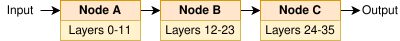
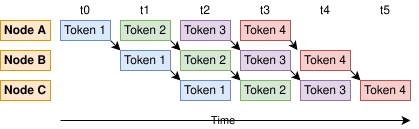

# Distributed LLM Inference Experiment

This research is still a work in progress and aims to be completed by late March 2026. The proof of concept works locally using GPT-2 Small, and the next step is to create and run benchmarks on public cloud VMs.

## Background

Many modern large language models (LLMs) contain billions of parameters. Due to its size, running inference using large models such as LLaMA 3.1 405B and Qwen2-72B may not be feasible with a single node, necessitating sharding across multiple nodes. This project aims to create a distributed inference system using open-weight models by partitioning the model layers across distributed nodes. The method proposed is distributed model parallelism. The core idea is to take a transformer-based model and split its layers across multiple machines.

<p align="center">
  
</p>
<p align="center">
  <sub><b>Figure 1:</b> Neural network layer partitioning.</sub>
</p>

Each node runs its chunk of the model on the input activations from a microbatch and then passes the resulting activation tensor to the next node. Multiple microbatches can be processed concurrently in different pipeline stages, allowing the model to be efficiently split across smaller machines and increasing overall throughput.

<p align="center">
  
</p>
<p align="center">
  <sub><b>Figure 2:</b> Pipeline parallelism. Each microbatch is represented internally as a tensor of activations flowing between pipeline stages.</sub>
</p>

The primary goals of this study are to learn how to create such a system from scratch and benchmark the performance, scalability, and its trade-offs. Due to its distributed nature, the primary penalty is the latency caused by communication overhead between nodes. In addition, challenges arise from scheduling complexity, fault tolerance, straggler (slow) nodes, error propagation, and debugging.

The emphasis of this project are the benefits and trade-offs of distributed computing in model inference, and optimizing for maximum performance is not part of the design goal. Therefore, to simplify the deployment environment and save costs, the model will run using CPU only and will not utilize any GPU. By not requiring a GPU, the setup can be easily replicated with generic cloud virtual machines.

<p align="center">
  
</p>
<p align="center">
  <sub><b>Figure 3:</b> System architecture overview.</sub>
</p>

With that constraint in mind, this study is using GPT-2 family models. It has simple, well-understood architecture making it simple enough to understand every component but complex enough to reveal real distributed systems challenges. There are also non-technical practical benefits, such as its mature ecosystem with excellent documentation and permissive license (MIT).

Specifically, the proof-of-concept will use GPT-2 Small to build the infrastructure and validate the architecture works before scaling. It has 124M parameters and 12 layers that are easy to split, test, and runs very fast even on CPU. Eventually, the experiment will use GPT-2 XL, as the size is large enough that distributed inference makes sense in that it will not fit easily in a single CPU memory with full context. At 1.5B parameters and 48 layers, the size will see real benefits from sharding without needing excessive infrastructure.

Inter-process communications is using HTTP as the overhead is extremely small compared to the inference latency.

## Local Installation

1. Use Python 3.11 as it provides universal compatibility; pyenv is recommended
2. Install Poetry `pipx install poetry`
3. Install dependencies `poetry install --no-root`
4. Run `./launch_local.sh` to launch gateway and worker nodes
5. Run `benchmark-dashboard` to optionally launch benchmarking dashboard

### Sending request
```sh
curl -X POST http://localhost:8000/generate \
     -H 'Content-Type: application/json' \
     -d '{"prompt": "Hello world!"}'
```

### Configure model and worker nodes
```sh
./launch_local.sh              # default: 3 worker nodes, gpt2 model
./launch_local.sh 4            # 4 worker nodes
./launch_local.sh 2 gpt2-xl    # 2 nodes, gpt2-xl model
```

## Dashboard
To run benchmarks and aid result visualization, we are using Streamlit dashboard.

```sh
streamlit run benchmark/dashboard.py
```

## Planned Research Variables

### Number of nodes
1, 2, 4

Powers of 2 make it easy to reason about halving compute per node. Since layers of both GPT-2 Small and GPT-2 XL can be evenly divided by those numbers, the number of layers for each node will be the same.

### Input sequence length
32, 256, 1024

Affects prefill cost and KV cache size.

### Concurrent clients
1, 4, 16

Simulates real traffic.

### Fixed variables
- Model: gpt2-xl (1.5B params, 48 layers)
- Generation length: 50 tokens, enough to capture autoregressive steady-state behavior without making runs long
- Sampling: Greedy (argmax) for deterministic result
- Planned VM: GCP `e2-highmem-2` (2 vCPU, 16 GB RAM), enough vCPU for GPT-2 XL inference and RAM for model, activations, KV cache, and other overheads
- Network topology: Same availability zone to minimize network variance
- Torch: Running on inference mode with 2 threads
- Warmup runs: 1 (discarded)
- Measurement runs: 3 (median)

## Planned Metrics
- End-to-end latency: Wall clock from request sent to response received at the client
- Time to first token: Timestamp of first token minus request start
- Tokens per second: `generated_tokens / end_to_end_time` for single client; `total_tokens_across_all_clients / wall_clock` for concurrent
- Per-node memory (RSS): `psutil` or `/proc/self/status` to measure peak RSS on each worker, validating whether sharding reduces memory
- Serialization time: Time to serialize/deserialize tensors, as it could be a hidden bottleneck
- Compute time per stage: Time each worker spends in `model.forward()`

## Experiment Design

### Experiment 1 — Scaling
Question: At what point does adding nodes help or hurt latency?

#### Parameter Values
- Nodes: 1, 2, 4
- Input length: 32, 256, 1024
- Concurrent clients: 1

### Output
- Plot: Latency (p50, p95) vs. nodes, one line per input length
- Expected: Short input (32) multi-node is always slower. Long input (1024) multi-node eventually wins.

### Experiment 2 — Concurrency
Question: Does pipeline parallelism actually utilize idle stages when multiple requests arrive concurrently?

#### Parameter Values
- Nodes: 1, 2, 4
- Input length: 256
- Concurrent clients: 1, 4, 16

### Output
- Plot: Throughput (total tokens/sec) vs. nodes, one line per concurrency level
- Expected: With 1 client, adding nodes hurts throughput. With 16 clients, adding nodes should improve throughput because pipeline stages overlap across requests.

### Experiment 3 — Input sensitivity
Question: How does input length affect the distribution trade-off?

#### Parameter Values
- Nodes: 1, 2, 4
- Input length: 32, 256, 1024
- Concurrent clients: 1

### Output
- Plot: TTFT vs. input length, one line per node count
- Purpose: Prefill is a single compute-heavy pass. Longer input results in larger activation tensors but also more compute per stage. This reveals the compute-to-communication ratio.
- Note: This reuses Experiment 1 data with a different metric (TTFT instead of end-to-end latency).

### Experiment 4 — Memory
Question: Does sharding actually reduce per-node memory?

#### Parameter Values
- Nodes: 1, 2, 4
- Input length: 1024
- Concurrent clients: 1

### Output
- Plot: Peak RSS per node vs. node count
- Expected: Roughly linear decrease. Single node ~6 GB, 4 nodes ~1.5 GB each.
- Measured on: Each GCP VM via `psutil.Process().memory_info().rss`
- Note: This reuses Experiment 1 data
